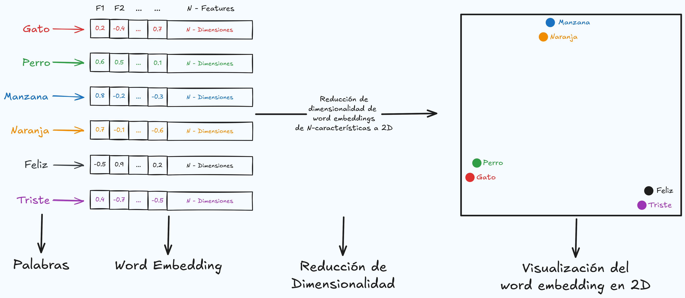

# word_embeddings_demo
Éste mini proyecto muestra cómo representar palabras con vectores numéricos (word embeddings) y cómo visualizar sus relaciones semánticas en 2D

## Descripción
Los **word embeddings** son una técnica del procesamiento de lenguaje natural (NLP) que convierte palabras en vectores dentro de un espacio contínuo, de forma que las palabras con significados similares están más cerca entre sí.



En esta notebook se muestra:

- Cómo generar los vectores de palabras usando un modelo preentrenado
- Cómo medir la similitud entre palabras
- Cómo reducir la dimensionalidad de los embeddings (PCA en nestro caso para visualizarlos en 2D)
- Cómo interpretar la distancia entre palabras en el espacio vectorial

## Contenido
- **Word2Vec.ipyb**: Notebook principal con el código paso a paso
- **Embeddings.png**: Imagen que ilustra el proceso de forma visual (_Es una representación_)

## Requisitos
Asegúrate de tener instaladas las siguientes librerías:
```
pip install gensim matplotlib scikit-learn
```
También puedes abrir la notebook directamente en Google Colab
